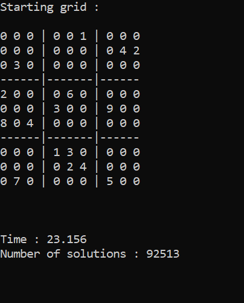

# Automatic Sudoku Solver

Here is my first project in C++, which is an automatic Sudoku Solver.

To use it, simply define the grid you want to solve at the beginning of the "main" function. I added a few "template" grids to help you do that. 
Then, select whether you want:
- To calculate only one solution, or every solution.
- To display the steps of the computer's calculations, or not.
- (Only if you choose to calculate every possibilities) To display only what is the number of solutions, or also display what these solutions are.

To create it, I translated in C++ code the way I proceed when I'm solving myself a Sudoku, which is the following:
- Check if there is a line, column or box where a number can be in only one place (for example "The number 7 can be in only one place in line 4").
- Check if there is a cell that has only one possible number.
- If we have none of those, then we have to try several hyptohesis. An important part of the project was to determine which hypothesis to try so we drastically reduce the calculation time.

If you see any bug, please don't hesitate to tell me :)

## Screenshots

Calculating only one solution

Calculating every solution

Displaying all the computer's steps

