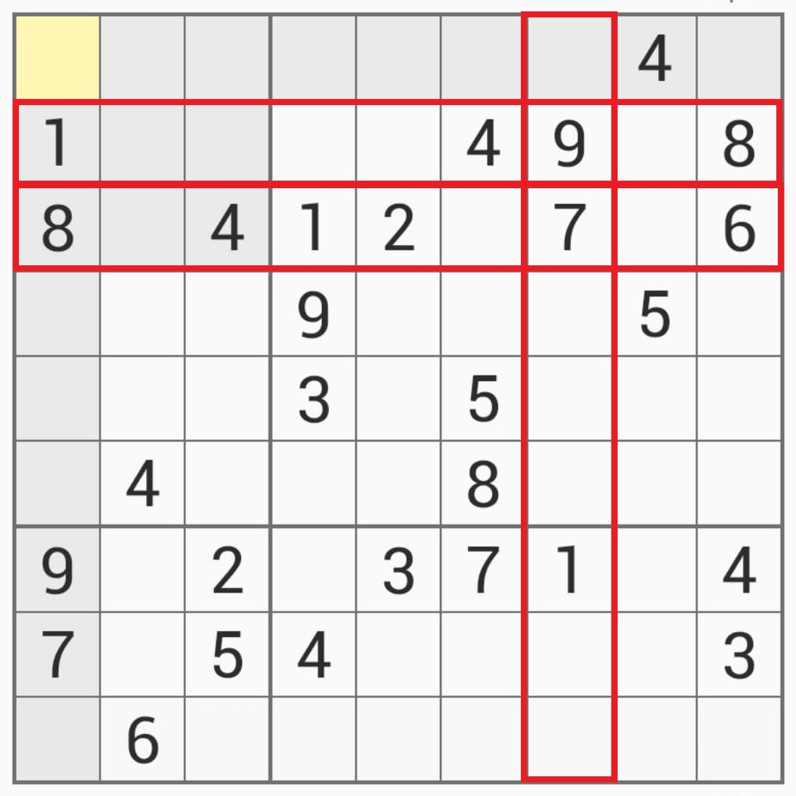

# Automatic Sudoku Solver

Here is my first project in C++, which is an automatic Sudoku Solver.

If you don't know the rules of Sudoku, you can see it here https://en.wikipedia.org/wiki/Sudoku

To use it, you have to define the grid you want to solve at the beginning of the "main" function. I added a few "template" grids to help you do that. 
You can also select whether you want:
- To calculate only one solution or every solution.
- To display the steps of the computer's calculations or not.
- (Only if you choose to calculate every solution) To display only the number of solutions, or also display what the solutions are.

To create it, I translated in C++ code the way I proceed when I solve a Sudoku, which is the following:
- Check if there is a line, a column or a box where a number can be in only one place.
For example, in the image below, we can't have a 1 in the red boxes, so we have a 1 in the upper-right cell.

- Check if there is a cell that has only one possible number.
- If we have none of those, try several hyptohesis. An important part of the project was to determine which hypothesis to try so we drastically reduce the calculation time.

If you see any bug, please don't hesitate to tell me :)

## Screenshots

Calculating only one solution

Displaying all the computer's steps

